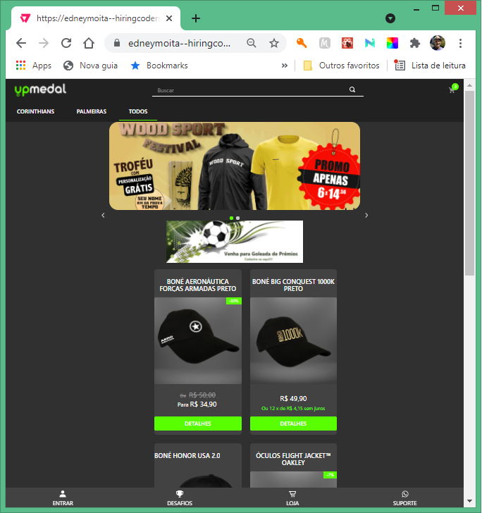
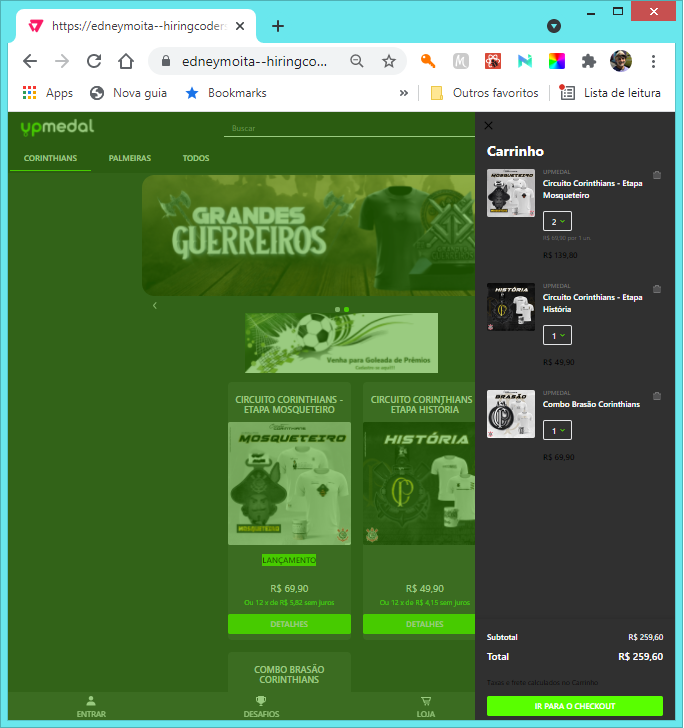
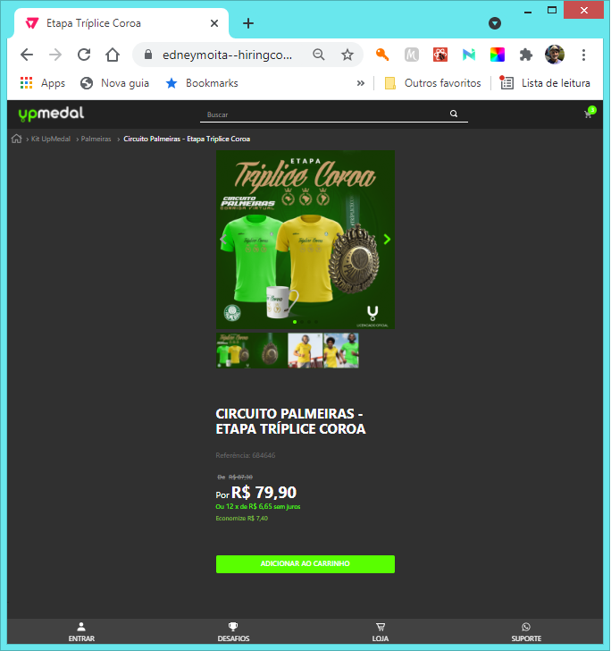
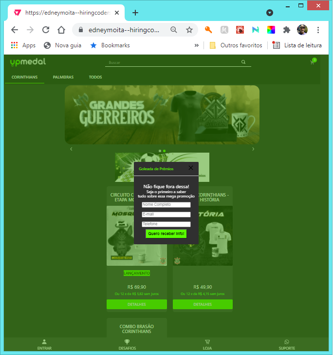

# Desafio Final VTEX Hiring Coders 2021
## Montar loja online, tendo como base a loja [UpMedal](https://www.upmedal.com/desafios), e utilizando o VTEX IO como plataforma de desenvolvimento
 
Desenvolvido como parte do treinamento VTEX - Hiring Coders 2021.
 
 
    

***
## Regras do desafio

Foi solicitado que fosse feita uma loja digital baseada no loja atual da empresa [UpMedal](https://www.upmedal.com/desafios), aproximando-se o máximo possível do original. Foi exigido que alguns componentes específicos do VTEX IO deveriam ser utilizados e personalizados para ficarem de acordo, tais como: tab-layout, product-summary, slider-layout, custom-query e minicart; e também fossem criados componentes customizados em React para integração com WhatsApp e nuvem AWS (captação de clientes para lista de distribuição). A aplicação resultante ficou disponível na nuvem da VTEX, na loja HIRINGCODERS2021 (com acesso restrito aos usuários do VTEX IO).

***
## Endereço da Loja

[UpMedal - Hiring Coders - Versão Edney Moita](https://edneymoita--hiringcoders2021.myvtex.com/) (acesso restrito)

***
## Desenvolvido em

            

***

## Dependências

- [vtex.whatsappio@0.0.0](https://github.com/edneymoita/whatsapp-io) - Componente React responsável pela integração com a API do WhatsApp paa suporte de loja.
- [vtex.recordleads@0.0.0](https://github.com/edneymoita/recordleads) - Componente React responsável por apresentar uma tela de captação de dados dos clientes e armazená-los na nuvem da AWS, usando o GraphQL, Lambda e DynamoDB.

(para linkar corretamente a loja no VTEX IO em um workspace qualquer é preciso antes linkar os componentes acima, disponíveis nos repositórios informados.)

***

## Loja montada

Página inicial da loja, com produtos em destaque e listagem de produtos referentes ao menu destacado.
 
 

 
 
Carrinho de compras seguindo o padrão da loja
 
 

 
 
Página de produto, apresentando o produto escolhido e todos os detalhes.
 
 

 
 
Modal para captação de dados de clientes (componente React externo)
 
 

 
 

***

## Licença

[EM](https://github.com/edneymoita)
